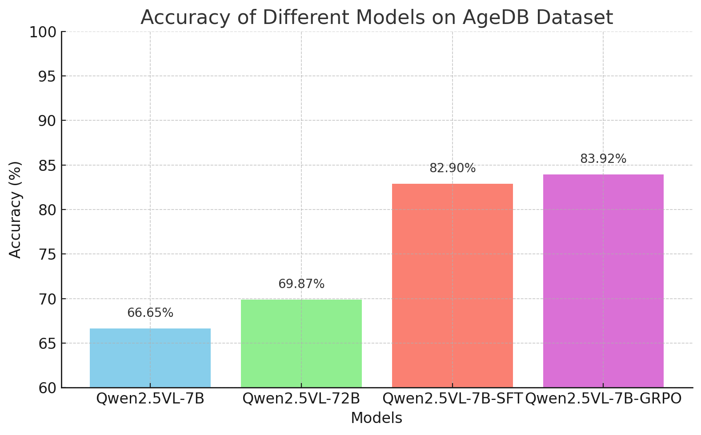
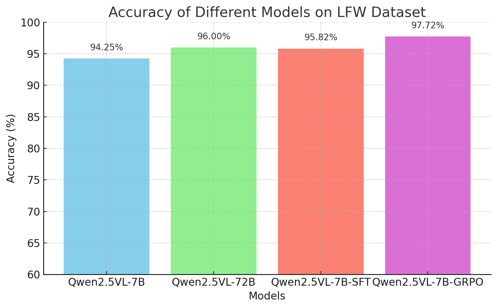
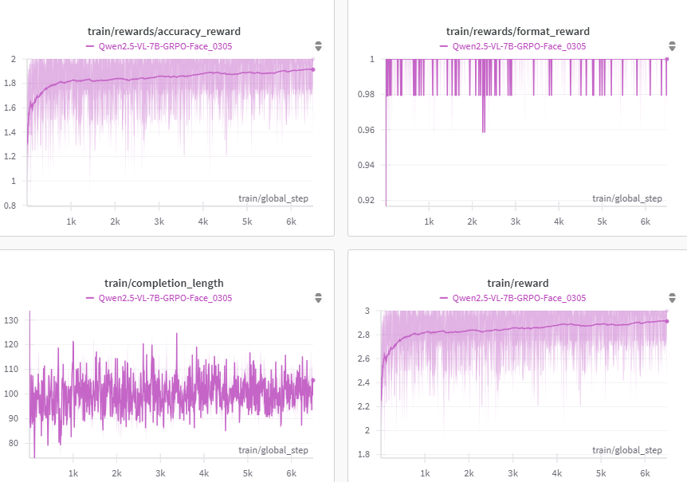

# VLM-Face: A Face Recognition Large Vision-Language Model


With the recent popularity of Reinforcement Fine-Tuning (RFT) techniques such as GRPO in Vision-Language Models (VLMs), numerous works have emerged aiming to reproduce and further enhance this approach. Motivated by this trend, we also explored the application of RFT-VLM techniques to a fine-grained task—face recognition—and present some results obtained from this study.

Specifically, we trained [Qwen2.5-VL](https://github.com/QwenLM/Qwen2.5-VL) using both GRPO and SFT approaches for the 1:1 Face Recognition task. Preliminary results indicate that applying GRPO methods can effectively improve the performance of Vision-Language Models (VLMs) on face recognition tasks. (as shown in the figures below)


<div style="margin-left: 5%;">

</div>

<div style="margin-left: 5%;">

</div>

<div style="margin-left: 5%;">

</div>

## Update

- 2025-02-15: We release the VLM-Face repository including training and testing script.

## Setup

```bash
conda create -n vlm-face python=3.10
conda activate vlm-face
bash setup.sh
```

## Training

### Face Recognition

#### GRPO

> 1. Download the dataset CALFW & CFP-FP, and [annotations](https://drive.google.com/drive/folders/1lchIgqjj38f6H1Ol62oP5xbnD3PMS3en?usp=sharing) here.

> 2. Write the path of the annotation files in the `src/open-r1-multimodal/data_config/face_train.json` file.
```json
    "cfp_ff_direct": {
      "root": "<your_image_root>",
      "annotation": "<your_caption_path>",
      "data_augment": false,
      "repeat_time": 1,
      "length": 7000
    },
    "calfw_direct": {
      "root": "<your_image_root>",
      "annotation": "<your_caption_path>",
      "data_augment": false,
      "repeat_time": 1,
      "length": 6000
  }
```

> 3. ```bash src/open-r1-multimodal/run_grpo_face.sh```

> NOTE: If you encounter 'CUDA out of memory' error, you can try to (1) change the ds config to local_scripts/zero3_offload.json (2) set `gradient_checkpointing` as `true`, (3) reduce the `num_generations`.

```bash
cd src/open-r1-multimodal

torchrun --nproc_per_node="8" \
    --nnodes="1" \
    --node_rank="0" \
    --master_addr="127.0.0.1" \
    --master_port="12346" \
    src/open_r1/grpo_face_cot.py \
    --deepspeed local_scripts/zero3.json \
    --output_dir output/$RUN_NAME \
    --model_name_or_path Qwen/Qwen2.5-VL-7B-Instruct \
    --dataset_name face_0325 \
    --dataset_config_path data_config/face_demo.json \
    --max_prompt_length 4096 \
    --max_completion_length 1024 \
    --num_generations 7 \
    --per_device_train_batch_size 1 \
    --gradient_accumulation_steps 2 \
    --logging_steps 1 \
    --beta 0.00005 \
    --bf16 \
    --data_seed 42 \
    --report_to wandb \
    --gradient_checkpointing false \
    --attn_implementation flash_attention_2 \
    --num_train_epochs 3 \
    --run_name $RUN_NAME \
    --save_steps 100 \
    --max_pixels 802816 \
    --save_only_model True \
    --learning_rate 0.0000009
```

<!--  -->
<!--  -->

<!-- 
#### SFT
We use [LLaMA-Factory](https://github.com/hiyouga/LLaMA-Factory) to train the SFT model.
> 1. Clone the [LLaMA-Factory](https://github.com/hiyouga/LLaMA-Factory) repository and install the dependencies.
```bash
git clone https://github.com/hiyouga/LLaMA-Factory.git
cd LLaMA-Factory
pip install -e ".[torch,metrics]"
```

> 2. Download the dataset_info.json, mllm_rec_json.json, and qwen2_5_vl_full_sft.yaml we provided [here](https://huggingface.co/datasets/omlab/VLM-R1/tree/main/sft_related). Put the json files in the `LLaMA-Factory/data` directory and the yaml file in the `LLaMA-Factory/examples/train_full` directory.

> 3. Run the following command to train the SFT model.
```bash
llamafactory-cli train examples/train_full/qwen2_5_vl_full_sft.yaml
```

### For your own data
We also support data loading the jsonl data of this format in [`src/open-r1-multimodal/src/open_r1/grpo_jsonl.py`](src/open-r1-multimodal/src/open_r1/grpo_jsonl.py). Please note that you may need to use different reward functions for your specialized tasks. Welcome to PR to add your own reward functions or share any other interesting findings!

The jsonl has the format as follows:
```json
{"id": 1, "image": "Clevr_CoGenT_TrainA_R1/data/images/CLEVR_trainA_000001_16885.png", "conversations": [{"from": "human", "value": "<image>What number of purple metallic balls are there?"}, {"from": "gpt", "value": "0"}]}
```

Note: The image path in the jsonl file should be relative to the image folder specified in `--image_folders`. The absolute path of the input image is constructed as `os.path.join(image_folder, data['image'])`. For example:
- If your jsonl has `"image": "folder1/image1.jpg"`
- And you specify `--image_folders "/path/to/images/"`
- The full image path will be `/path/to/images/folder1/image1.jpg`

Multiple data files and image folders can be specified using ":" as a separator:
```bash
--data_file_paths /path/to/data1.jsonl:/path/to/data2.jsonl \
--image_folders /path/to/images1/:/path/to/images2/
```

The script can be run like this:
```bash
torchrun --nproc_per_node="8" \
    --nnodes="1" \
    --node_rank="0" \
    --master_addr="127.0.0.1" \
    --master_port="12345" \
  src/open_r1/grpo_jsonl.py \
    --output_dir output/$RUN_NAME \
    --model_name_or_path Qwen/Qwen2.5-VL-3B-Instruct \
    --deepspeed local_scripts/zero3.json \
    --dataset_name <your_dataset_name> \
    --data_file_paths /path/to/your/data.jsonl \ # can be multiple, separated by ":"
    --image_folders /path/to/your/image/folder/ \ # can be multiple, separated by ":"
    ...
```

 -->
## Evaluation


> 1. Download the [LFW & AgeDB] dataset(https://huggingface.co/datasets/omlab/VLM-R1/resolve/main/refgta.zip).

> 2. Start the vllm server (if you have more gpu resources, you can adjust the -tp number higher)

```bash
vllm serve your_model_path --max-model-len 8192 --trust-remote-code -tp 1 --limit-mm-per-prompt image=2
```
> 3. Run the test script

```bash
cd ./src/test

# Remember to change the config in the bash script and also dataset folder path in the python script
bash test_vllm.sh
```

## Acknowledgements

We would like to express our sincere gratitude to [VLM-R1](https://github.com/om-ai-lab/VLM-R1), [Open-R1-Multimodal](https://github.com/EvolvingLMMs-Lab/open-r1-multimodal), [R1-V](https://github.com/Deep-Agent/R1-V), [Open-R1](https://github.com/huggingface/open-r1), [QwenVL](https://github.com/QwenLM/Qwen2.5-VL),  and [DeepSeek](https://github.com/deepseek-ai/DeepSeek-R1) for providing open-source resources that contributed to the development of this project.


<!-- 
## Citation
If you find this project useful, welcome to cite us.
```bib
@misc{shen2025vlmr1,
  author       = {Shen, Haozhan and Zhang, Zilun and Zhang, Qianqian and Xu, Ruochen and Zhao, Tiancheng},
  title        = {VLM-R1: A stable and generalizable R1-style Large Vision-Language Model},
  howpublished = {\url{https://github.com/om-ai-lab/VLM-R1}},
  note         = {Accessed: 2025-02-15},
  year         = {2025}
}
```
-->